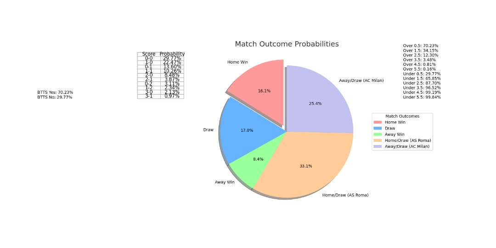

# SmartBetNaYo

<p align="center">
  
</p>

**SmartBetNaYo** is an application for predicting the outcomes of football matches using historical statistics and Poisson analysis to provide probabilities for match outcomes. Designed especially for sports bettors, this tool helps in making informed bets by calculating the odds of various match outcomes including exact scores, win/lose/draw probabilities, and whether both teams will score.

## Features

- **Automatic data retrieval** from the API-football.
- **Probability calculations** using the Poisson distribution for exact scores.
- **Predictions for "Both Teams to Score" (BTTS)**.
- **Estimates for over/under goals probabilities**.

## Technologies Used

- **Python 3**
- **Python Libraries**: `requests`, `matplotlib`, `numpy`, `scipy`
- **API-football** for real-time match data.

## How to Use

To use SmartBetNaYo, follow these steps:

```bash
git clone git@github.com:enzoforreal/SmartBetNaYo.git
cd SmartBetNaYo

Installation
Then, install the necessary dependencies:
pip install -r requirements.txt

Contribute

SmartBetNaYo is open for contributions from developers, statisticians, and sports betting enthusiasts. 
If you have ideas for improving predictions, integrating artificial intelligence, 
or optimizing existing algorithms, your input is welcome!

How to Contribute?

Fork the project on GitHub.
Clone your fork locally:

git clone https://github.com/<your-username>/SmartBetNaYo.git
Create a new branch for your changes:
git checkout -b your_branch_name

Make your changes and modify the necessary files in your local project.
Commit your changes:

git add .
git commit -m "Describe your modifications"

Push your changes to GitHub:

git push origin your_branch_name

Open a Pull Request to merge your changes: Go to your fork on GitHub, click on 'Pull Request' then 'New Pull Request'. Select your branch and proceed by clicking 'Create pull request'.
We appreciate your ideas and encouragement to improve SmartBetNaYo! All contributions help make the application more effective and useful for everyone.

License
This project is licensed under the MIT License. For more details, see the LICENSE file. 


